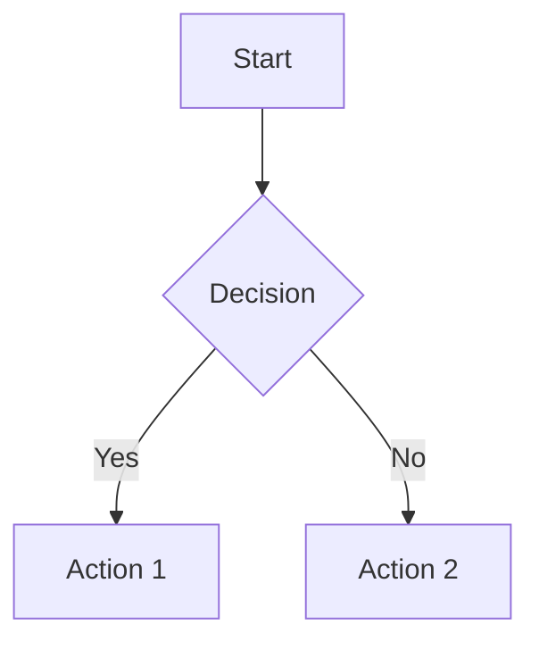
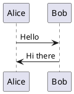

# Azure DevOps Wiki — TOAST UI (Markdown) Browser Extension

A powerful browser extension that enhances Azure DevOps Wiki editing with the TOAST UI Editor, providing advanced markdown editing capabilities, diagram support, and seamless integration with Azure DevOps.

## 🚀 Features

### ✨ Enhanced Markdown Editor
- **TOAST UI Editor**: Rich markdown editing experience with live preview
- **Dual Mode**: Switch between WYSIWYG and Markdown modes
- **Syntax Highlighting**: Code blocks with Prism.js syntax highlighting
- **Smart Paste**: Converts HTML content (from web pages, Word docs, etc.) to markdown automatically
- **Keyboard Shortcuts**: Ctrl/Cmd+S to save directly

### 📊 Diagram & Chart Support
- **Mermaid Diagrams**: Create flowcharts, sequence diagrams, and more with ```mermaid code blocks
- **PlantUML**: Generate UML diagrams using PlantUML server integration
- **Charts**: Interactive charts and graphs support
- **Math Formulas**: Render mathematical expressions

### 🎨 Advanced Formatting
- **Color Syntax**: Apply colors to text with HTML color tags
- **Font Styling**: Custom font family support with `<font face="...">` tags
- **Table Features**: Advanced table editing with merged cells support
- **HTML Support**: Use HTML tags for advanced formatting

### 🖼️ Image Management
- **Drag & Drop Upload**: Upload images directly to Azure DevOps Wiki Attachments
- **Paste Images**: Paste images from clipboard with automatic compression
- **Image Compression**: Client-side image optimization to reduce file sizes
- **Auto-resize**: Configurable maximum image dimensions

### 📤 Export Capabilities
- **PDF Export**: Export wiki pages as PDF documents
- **DOCX Export**: Generate Word documents from wiki content
- **Preserve Formatting**: Maintain styles and structure in exports

### ⚙️ Customization Options
- **Plugin Control**: Enable/disable specific features as needed
- **Shadow DOM**: Isolate editor styles from Azure DevOps interface
- **Demo Mode**: Match the original Azure DevOps experience
- **Chart Sizing**: Configurable chart dimensions
- **Image Quality**: Adjustable compression settings

## 🛠️ Installation

### From Source
1. Clone this repository:
   ```bash
   git clone <repository-url>
   cd azuredevops-browser-extension
   ```

2. Install dependencies:
   ```bash
   npm install
   ```

3. Build the extension:
   ```bash
   npm run build
   ```

4. Load the extension in Chrome:
   - Open Chrome and navigate to `chrome://extensions/`
   - Enable "Developer mode"
   - Click "Load unpacked" and select the `dist` folder

### Development
For development with hot reload:
```bash
npm run watch
```

## ⚙️ Configuration

Access the extension options by:
1. Right-clicking the extension icon and selecting "Options"
2. Or navigating to `chrome://extensions/` and clicking "Details" → "Extension options"

### Settings Overview

#### Authentication
- **Personal Access Token (PAT)**: Required for image uploads to Azure DevOps
  - Scope needed: Wiki (Read & write)
  - Stored locally in browser storage

#### Editor Behavior
- **Match Demo Mode**: Show/hide WYSIWYG toggle to match original Azure DevOps experience
- **Shadow DOM**: Isolate editor styles (recommended for most users)

#### Plugin Configuration
- **Enable All Plugins**: Master toggle for all TOAST UI plugins
- **Code Syntax**: Prism.js syntax highlighting
- **Color Syntax**: Text color support
- **Charts**: Chart and graph rendering
- **Table Merged Cells**: Advanced table features
- **UML**: PlantUML diagram support
- **Mermaid**: Mermaid diagram support (custom implementation)

#### Customization
- **Default Font Family**: Font applied when using font styling tools
- **Chart Dimensions**: Min/max width and height for charts
- **UML Renderer URL**: PlantUML server endpoint
- **Image Settings**: Max width and compression quality for uploads

## 🎯 Usage

### Basic Editing
1. Navigate to any Azure DevOps Wiki page in edit mode
2. The TOAST UI editor will automatically replace the standard editor
3. Use the toolbar for formatting or write markdown directly
4. Press Ctrl/Cmd+S to save

### Adding Diagrams

#### Mermaid Diagrams





#### PlantUML Diagrams




### Image Upload
1. Ensure PAT is configured in options
2. Drag and drop images into the editor
3. Or paste images from clipboard
4. Images are automatically compressed and uploaded to Azure DevOps

### Text Formatting
- **Colors**: `<font color="red">Red text</font>`
- **Fonts**: `<font face="Arial">Arial text</font>`
- **Combined**: `<font face="Georgia" color="#0066cc">Styled text</font>`

### Exporting
1. Use the export buttons in the custom toolbar
2. **Export → PDF**: Generate PDF with current formatting
3. **Export → Word**: Create DOCX file with preserved styles

## 🏗️ Project Structure

```
├── src/
│   ├── content.ts          # Main content script - editor integration
│   ├── options.ts          # Options page functionality
│   ├── util.ts            # Utility functions for DOM manipulation
│   └── styles.d.ts        # TypeScript declarations for CSS imports
├── static/
│   └── options.html       # Options page HTML
├── scripts/
│   └── build.mjs          # Build configuration (esbuild)
├── dist/                  # Built extension files
├── manifest.json          # Chrome extension manifest
└── package.json          # Dependencies and scripts
```

## 🔧 Technical Details

### Dependencies
- **TOAST UI Editor**: Core markdown editor
- **TOAST UI Plugins**: Code syntax, color syntax, charts, UML, tables
- **Mermaid**: Diagram rendering (custom integration)
- **Prism.js**: Syntax highlighting
- **Turndown**: HTML to Markdown conversion
- **DOMPurify**: HTML sanitization
- **html2pdf.js**: PDF export functionality
- **html-docx-js**: Word document export
- **browser-image-compression**: Client-side image optimization

### Browser Compatibility
- Chrome 110+
- Other Chromium-based browsers (Edge, Brave, etc.)

### Azure DevOps Compatibility
- Azure DevOps Services (dev.azure.com)
- Azure DevOps Server (on-premises installations with *.visualstudio.com domains)

## 🚀 Development

### Prerequisites
- Node.js 18+
- npm 8+

### Scripts
- `npm run build`: Build production version
- `npm run watch`: Development build with file watching
- `npm test`: Run tests (if available)

### Build Process
The extension uses esbuild for fast compilation:
- TypeScript → JavaScript
- CSS imports → Inline text
- Bundle optimization for browser environment
- Manifest and static file copying

### Code Organization
- **content.ts**: Main logic for editor injection and Azure DevOps integration
- **options.ts**: Settings management and storage
- **util.ts**: Helper functions for DOM manipulation and URL parsing
- **build.mjs**: Custom build script with esbuild configuration

## 🤝 Contributing

1. Fork the repository
2. Create a feature branch: `git checkout -b feature-name`
3. Make changes and test thoroughly
4. Commit with descriptive messages
5. Push and create a pull request

### Development Guidelines
- Use TypeScript for type safety
- Follow existing code style and patterns
- Test changes in both demo and production Azure DevOps environments
- Ensure compatibility with different Azure DevOps configurations

## 📝 License

This project is licensed under the MIT License. See the LICENSE file for details.

## 🐛 Known Issues & Limitations

- Some advanced TOAST UI features may not work in all Azure DevOps configurations
- Image upload requires valid PAT with appropriate permissions
- Export features depend on browser capabilities and popup blockers
- Shadow DOM mode may affect some custom Azure DevOps themes

## 🔮 Future Enhancements

- [ ] Support for more diagram types
- [ ] Enhanced table editing features
- [ ] Collaborative editing indicators
- [ ] Custom themes and styling
- [ ] Offline editing capabilities
- [ ] Advanced search and replace

## 📞 Support

For issues, feature requests, or questions:
1. Check existing issues in the repository
2. Create a new issue with detailed description
3. Include browser version, Azure DevOps environment, and extension version

---

**Made with ❤️ for the Azure DevOps community**
